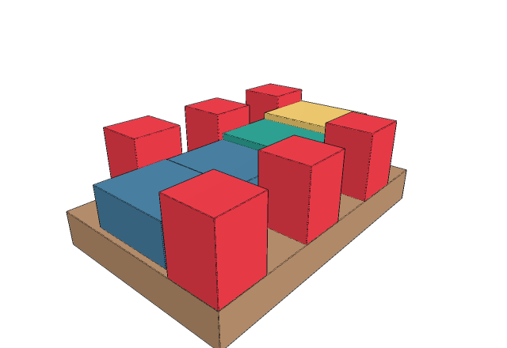
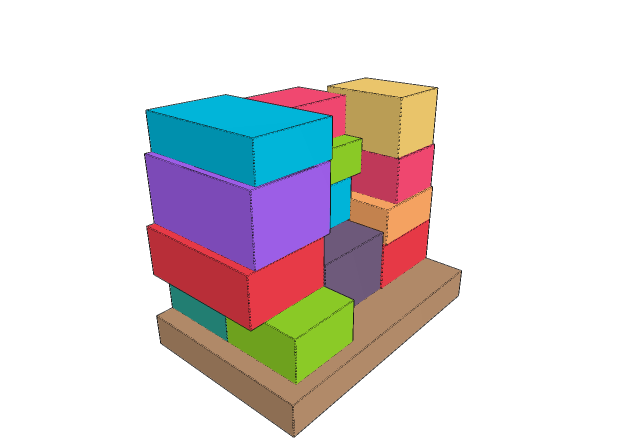
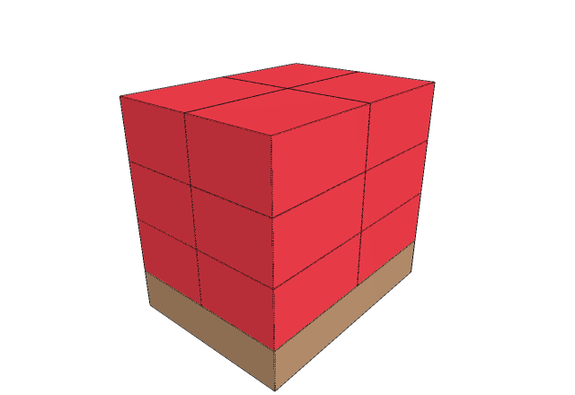
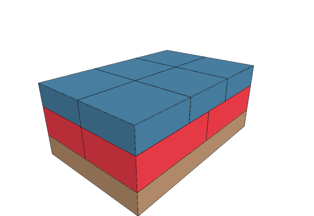
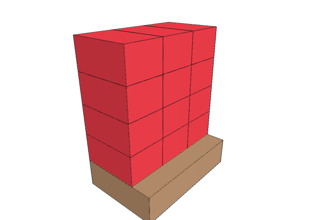
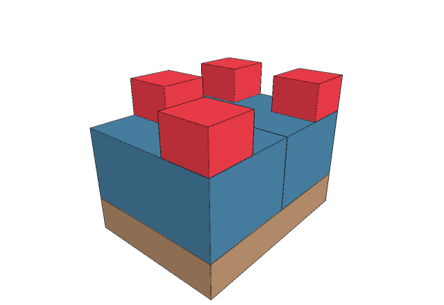

# pallet-pack

Single-pallet 3D box packing that produces **stable loads a second
pallet can stand on** (double-stackable) — with an independent verifier
and a 3D step-through viewer.

**Click any picture for the live 3D viewer** (build-order slider, camera
presets, per-SKU legend). Shown: each case solved with the default `auto`
pattern:

| | | |
|:---:|:---:|:---:|
| [](https://gist.githack.com/ajaygunalan/ee5534323756312431e6e5b317a886de/raw/acceptance_1.html) **acceptance_1** | [](https://gist.githack.com/ajaygunalan/ee5534323756312431e6e5b317a886de/raw/grocery_order.html) **grocery_order** | [](https://gist.githack.com/ajaygunalan/ee5534323756312431e6e5b317a886de/raw/overflow_capped.html) **overflow_capped** |
| [](https://gist.githack.com/ajaygunalan/ee5534323756312431e6e5b317a886de/raw/two_layer_mixed.html) **two_layer_mixed** | [](https://gist.githack.com/ajaygunalan/ee5534323756312431e6e5b317a886de/raw/uniform_brick.html) **uniform_brick** | [](https://gist.githack.com/ajaygunalan/ee5534323756312431e6e5b317a886de/raw/heavy_small_light_giant.html) **heavy_small_light_giant** |

## The problem

Given one pallet and a list of box types (dimensions × count), place the
boxes so that:

1. **The stack stands** — every box properly supported, nothing topples at
   any point during the build (checked box by box, not just at the end).
2. **A second pallet can go on top** — the finished top offers flat
   contact, spread wide enough toward the deck's edges for a rigid pallet
   to sit on.

When placing every box would wreck stability or the stackable top, the
solver places what serves the goal and reports the rest as an honest
leftover list — never a forced placement.

**Out of scope, deliberately:**

- **Multi-pallet allocation** — exactly one pallet per run; splitting an
  order across pallets is a different problem.
- **Transport (dynamic) stability** — surviving braking and cornering is
  a separate problem with its own standards (EN 12195-1); we solve the
  standing-still one.
- **Crush / fragility limits** — whether a box can carry the weight
  stacked on it; the input carries no per-box strength number to check
  against (industry keeps this in master data).
- **Overhang** — boxes stay fully inside the pallet footprint, though
  real systems tolerate small overhangs.
- **Tipping boxes onto their sides** — boxes stay upright; only the two
  flat rotations are used.
- **Online arrival** — the full box list is known before packing starts;
  a conveyor setting would need a different search layer.
- **Pallet weight capacity** — the total load weight is never checked
  against what the pallet itself can bear.

## Input

```json
{
  "pallet": {"length": 1200, "width": 800, "deck_height": 145,
             "max_stack_height": null},
  "skus": [
    {"sku": "A", "dims": [206, 198, 278], "count": 6, "weight": null}
  ]
}
```

All dimensions are millimeters. Boxes are upright-only: the third
dimension is always the height. `weight` (kg) is optional — used when
every SKU has one, otherwise mass is estimated from volume.
`deck_height` is the pallet's own wood height (display and reporting
only); `max_stack_height` caps the load, measured from the deck surface
up. (The example is the `acceptance_1` case trimmed to its first SKU —
the full file has four, A through D.)

## Output

`plan_auto.json` — an ordered build plan plus a verdict (trimmed real
output for the full `acceptance_1` case):

```json
{
  "placements": [
    {"sequence": 1, "id": "A-1", "sku": "A",
     "x": 0, "y": 0, "z": 0, "rotated": false, "sits_on": ["deck"]},
    {"sequence": 7, "id": "D-1", "sku": "D",
     "x": 0, "y": 206, "z": 0, "rotated": false, "sits_on": ["deck"]},
    ...
  ],
  "leftovers": [],
  "verdict": {"stackable": true, "placed": 10, "total": 10,
              "top_coverage_pct": 25.5, "top_spread_pct": 87.7,
              "stack_height_mm": 278, "pattern": "platform", ...}
}
```

`x, y, z` is the box's bottom corner in mm from the deck corner;
`rotated: true` puts the first given dimension along X. `leftovers` are
boxes the plan chose not to place (they would break stability or the
stackable top). `plan_auto.html` is the same plan as an interactive 3D
page (see Viewer below). Files are named by the requested pattern
(`plan_auto…`, `plan_tiled…`), so runs never overwrite each other.

## The algorithm

### The world is a heightmap

We model the pallet's top surface — the **deck** — as a 1 mm grid; each
cell stores how tall the stack is at that spot [2]. A box's z is never
chosen: the box *lands* on the tallest cell under its footprint (its
*landing height*), so floating or clipping boxes are impossible by
construction.

```
side view:                        what the grid stores, cell by cell:

┌───────────┐                       220 220 220 192 192   0
│  D (220)  │┌─────────┐             ▲           ▲        ▲
│           ││ C (192) │           under D     under C   empty
─────────────────────────  deck
```

The grid IS the world model: every check below is plain arithmetic on
these numbers.

### Check 1 — SUPPORT: is the base held up?

Two conditions, both required — together they are what the literature
calls *partial base support with a support factor* [2]:

**(a) enough area** — ≥ 70 % of the base must rest at the landing height:

```
   ┌──────────────┐
   │   new box    │
   └┬─────────┬───┘                lands on D's top; under its right
    │    D    │  (air gap)         half there is only air — C's top
    │  (220)  │  ┌─────────┐       sits 28 mm lower. Only 50 % of
    │         │  │ C (192) │       the base is supported, needs
    │         │  │         │       ≥ 70 % → rejected (a see-saw)
 ───┴─────────┴──┴─────────┴── deck
```

**(b) held at both ends** — area alone is not enough: there must also
be support under both ends of the base (its left and right edges, or its
front and back edges). Same box, two ways to support it:

```
 support under BOTH ends — fine:      support only in the MIDDLE — fails:

 ┌───────────────────────┐            ┌───────────────────────┐
 │        new box        │            │        new box        │
 └┬─────┬─────────┬─────┬┘            └──────┬─────────┬──────┘
  │ box │  (air)  │ box │              (air) │   box   │ (air)
──┴─────┴─────────┴─────┴── deck     ────────┴─────────┴──────── deck

 both ends of the new box             81 % of the base is held, but
 have a box underneath —              both ends hang over air; one
 press either end, it pushes          nudge dips an end
 back: a bridge                       → rejected (a diving board)
```

### Check 2 — BALANCE: does every box stay over its footing?

For **every** box: the combined center of mass of it plus everything
stacked above must fall inside the support it receives from below — the
literature's *static mechanical equilibrium* [3]. Each single joint
below looks fine on its own; the failure only appears when the loads
combine:

```
             ┌─────────┐
             │  box 3  │
         ┌───┴─────┬───┘
         │  box 2 ✱│               ✱ = combined center of mass of
     ┌───┴─────┬───┘                   boxes 2 + 3 — it sits inside
     │  box 1  │  ┆                    box 2, but dropped straight
  ───┴─────────┴──┆────── deck         down (┆) it misses box 1:
                                       past its right edge, nothing
                                       underneath → boxes 2 + 3 tip
                                       → rejected
```

### The search — Beam Search with Greedy rollouts (BSG)

Greedy alone commits to what looks best *now*. BSG [1] keeps `w` alternative
half-finished pallets alive and judges each by how it *ends*: a fast
greedy rollout finishes every child, and the best snapshot along that
future is its score.

One step of the beam, drawn out (w = 2 here):

```
                one kept pallet (half built)
                           │
            try every legal next placement —
            CANDIDATES propose, CHECKS discard
             │             │             │
             ▼             ▼             ▼
         child 1       child 2       child 3      ← real moves:
             ┆             ┆             ┆          one box added
             ┆             ┆             ┆   ROLLOUT plays each
             ┆             ┆             ┆   child to the end — an
             ┆             ┆             ┆   imagined, throw-away
             ▼             ▼             ▼   future, used to grade
         ending 1      ending 2      ending 3
         stackable     NOT           stackable
         92% full      stackable     97% full
             │             │             │
             └─────────── grade ─────────┘
                           │
            keep the w best children (here: 3, 1),
            drop the rest, repeat with the next box;
            the best ending ever seen IS the plan

 the dial:  w = 1 ──────── 2 ──────── 4 ──────── 8
            plain greedy     restarts while the time budget
                             lasts; best plan from any run wins
```

The dashed lines are the point: rollouts are *imagined* futures, thrown
away after grading — only the single real move at the top of each branch
is kept. Twins (two different routes to the identical stack) are deleted
before grading so the beam stays diverse.

The **objective** judging every ending never changes: stackable beats
not-stackable, then more volume placed, then the fuller top contact.
Deterministic throughout — no randomness anywhere.

### Two stacking patterns

The rollout can finish a pallet two different ways; both endings are
scored and the objective picks (two specialist finishers beat one
compromise — see [4], [5]):

```
   tiled                        platform
  ┌─────────────┐              ┌─────────────┐
  │ A A A B B D │              │ A    A    A │    tallest boxes spread
  │ A A A B B D │              │  D C B B    │    like table legs carry
  │ C C . . . . │              │ A    A    A │    the upper pallet; short
  └─────────────┘              └─────────────┘    boxes tucked below
   tight from a corner,         (top views, schematic)
   maximum volume
```

## Architecture

```
case.json ──▶ solver.py ──▶ plan_auto.json ──▶ verify.py ──▶ PASS / FAIL
                                └───────▶ viewer.py ──▶ plan_auto.html
                    (main.py runs all three in one command)
```

| file | what it does |
|---|---|
| `solver.py` | finds the plan — the whole algorithm above (see inside below) |
| `verify.py` | checks a finished plan against five rules — geometry, support, balance, completeness, level top — with its own independent code |
| `viewer.py` | turns a plan into the interactive 3D page |
| `main.py` | one command that runs all three in order |
| `test_solver.py` | the stability-check diagrams above as test fixtures, plus expected results for every case |
| `cases/` | six test cases (below) + a saved expected plan the regression test compares against |

### Inside solver.py

The critical file. Eight numbered sections, top to bottom:

```
1. CONSTANTS    thresholds used by the stability and stackability checks
2. INPUT        loading a case; the SKU, Problem, and Placement records
3. CHECKS       the two stability checks: SUPPORT and BALANCE
4. CANDIDATES   the shortlist of positions worth trying for a box
5. STATE        one half-finished pallet: heightmap + placed + remaining
6. ROLLOUT      finishes a half-built pallet, to judge it by its ending
7. SEARCH       the beam: w competing futures, best ending wins
8. OUTPUT       writing the plan file; command-line entry
```

How they connect:

```
              case.json
                  │
                  ▼
                INPUT
                  │
                  ▼
   ┌─────────── SEARCH ───────────────┐
   │  runs over w half-finished       │
   │  pallets (STATEs):               │
   │                                  │
   │    ┌─▶ CANDIDATES                │
   │    │     spots the next box      │
   │    │     could go                │
   │    │        │                    │
   │    │        ▼                    │
   │    │     CHECKS                  │
   │    │     illegal spots           │
   │    │     discarded               │
   │    │        │                    │
   │    │        ▼                    │
   │    │     ROLLOUT                 │
   │    │     each future finished,   │
   │    │     its ending graded       │
   │    │        │                    │
   │    │        ▼                    │
   │    └─── keep the w best,         │
   │         take the next box        │
   │                                  │
   └────────────────┬─────────────────┘
                    │ boxes exhausted
                    ▼
                 OUTPUT
                    │
                    ▼
              the plan file       (CONSTANTS feed the checks and
                                   the grading throughout)
```

## How to run

```bash
uv run main.py cases/acceptance_1.json                    # solve → verify → render
uv run main.py cases/acceptance_1.json --pattern tiled    # force the tiled layout
uv run main.py cases/grocery_order.json --time-budget 15 -o out2   # quicker run
uv run pytest                                             # the test suite

python3 verify.py plan_auto.json cases/acceptance_1.json  # re-judge a solved plan
uv run viewer.py out/acceptance_1/plan_auto.json -o view.html   # re-render a plan
```

The first command runs the full 60-second search and drops
`plan_auto.json` + `plan_auto.html` in the current directory; add
`--time-budget 10` for a quick look.

## Runtime controls

The two per-run knobs (everything is deterministic: same inputs, same
knobs, same plan):

- `--time-budget SECONDS` (default 60) — how long the search may think.
  The greedy answer is banked in the first fraction of a second; every
  extra second lets wider beams finish and deposit better plans. More
  time never gives a worse answer.
- `--pattern auto | tiled | platform` (default `auto`) — the stacking
  pattern. `auto` plays both and the objective picks; the flag exists
  only to force a shape.

## Parameters

The constants that define what "stable" and "stackable" *mean*, at the
top of `solver.py` — calibration, not per-run tuning. Mirror any change
in `verify.py`: if the two files drift apart, the verifier fails the plan
loudly rather than hiding it.

| constant | default | meaning |
|---|---|---|
| `SUPPORT_FRAC` | 0.70 | min fraction of a box base resting at landing height |
| `SUPPORTER_MIN_FRAC` | 0.25 | min contact before a box below counts as a supporter |
| `FLAT_TOL` | 10 mm | tops within this of the maximum count as "the top level" |
| `STACK_AREA_FRAC` | 0.20 | min deck fraction the upper pallet must touch |
| `STACK_SPREAD_FRAC` | 0.60 | min deck fraction under the hull of that contact |
| `BEAM_WIDTHS` | 1, 2, 4, 8 | the beam restart schedule |

## Test cases (`cases/`)

Each case exists to prove one thing; expected results are pinned in
`test_solver.py`.

- **`acceptance_1`** — the original task: 6×A, 2×B, 1×C, 1×D on a
  1200×800 pallet. The four box heights never meet at one level, so
  tiling alone can't end stackable — the platform pattern spreads the six
  tall A-boxes and tucks B/C/D beneath. 10/10 placed, stackable.
- **`uniform_brick`** — one SKU that tiles the deck exactly. The sanity
  case: every box placed, flat top.
- **`overflow_capped`** — 20 boxes, a 600 mm height cap that fits 12.
  Proves honest leftovers, and the beam earning its keep: greedy finds 9,
  the w=4 beam recovers the perfect 12-box block at 100 % flat.
- **`two_layer_mixed`** — a heavy layer with a light layer on top:
  SUPPORT and BALANCE for boxes standing on boxes. Ends 100 % flat.
- **`heavy_small_light_giant`** — real weights: 25 kg small boxes vs 2 kg
  giant boxes. Proves weight-driven ordering and balance with true masses.
- **`grocery_order`** — a real 26-case, 20-SKU supermarket order from the
  BED-BPP industrial benchmark [6]: messy sizes, real weights, 2000 mm
  cap — and a visible demonstration that the objective ranks a stackable
  top above placing every box.

## The viewer (`plan_<pattern>.html`)

- **Slider** — replays the build order placement by placement.
- **Legend (top right)** — one entry per SKU; click to hide/show it.
- **Camera buttons** — isometric / top / front / side ("top" reads the
  footprint layout best).
- **Parameter panel (bottom left)** — case, pattern, budget, constants,
  verdict numbers.
- **Hover** — box id, position, dimensions, what it sits on.
- Boxes are drawn 1 mm smaller than reality (display only) so touching
  faces don't flicker.

## References

What each paper contributes to this implementation:

1. Araya & Riff, *A beam search approach to the container loading
   problem*, Computers & OR 43, 2014 — **the search**: beam + greedy
   rollout evaluation, twin removal, width restarts.
   <https://doi.org/10.1016/j.cor.2013.09.003>
2. Schuster et al., *Stable stacking for the distributor's pallet packing
   problem*, IROS 2010 — **the world model and the SUPPORT check**:
   heightmap, held-at-both-ends rule, ≥ 25 % supporter rule.
   <https://doi.org/10.1109/IROS.2010.5650217>
3. Ramos et al., *A container loading algorithm with static mechanical
   equilibrium stability constraints*, Transp. Res. B 91, 2016 — **the
   BALANCE check**: per-floor static equilibrium.
   <https://doi.org/10.1016/j.trb.2016.06.003>
4. Araya, Moyano & Sanchez, *A beam search algorithm for the biobjective
   container loading problem*, EJOR 2020 — **the two-pattern precedent**:
   re-orienting the greedy rollout per objective.
   <https://doi.org/10.1016/j.ejor.2020.03.040>
5. Bischoff & Marriott, *A comparative evaluation of heuristics for
   container loading*, EJOR 44(2), 1990 — **max over several deterministic
   constructors**, standard since 1990.
   <https://doi.org/10.1016/0377-2217(90)90362-F>
6. Kagerer et al., *BED-BPP: Benchmarking dataset for robotic bin packing
   problems*, IJRR 2023 — **source of `grocery_order`**.
   <https://doi.org/10.1177/02783649231193048>
